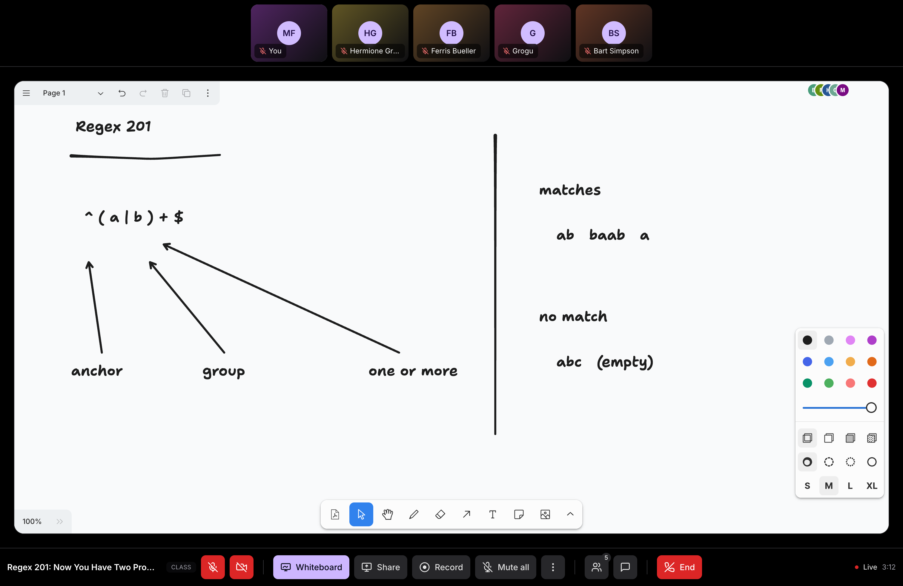
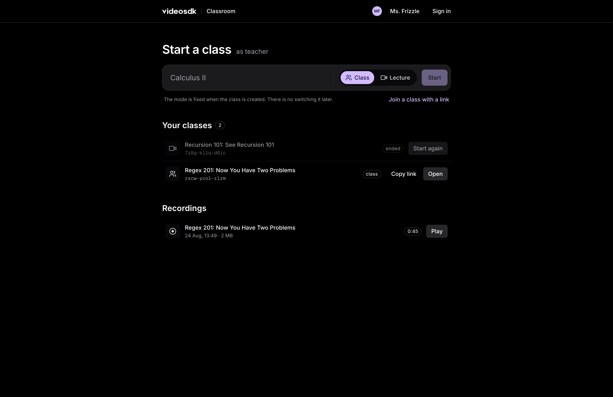
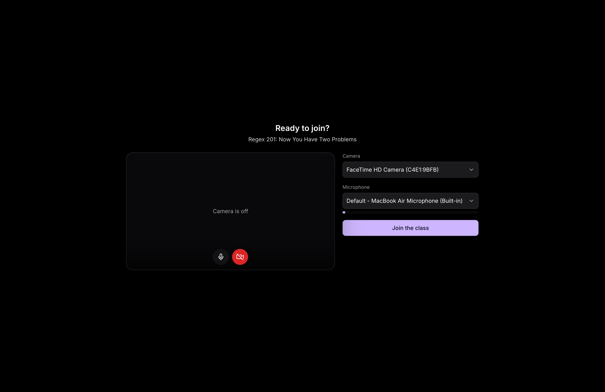
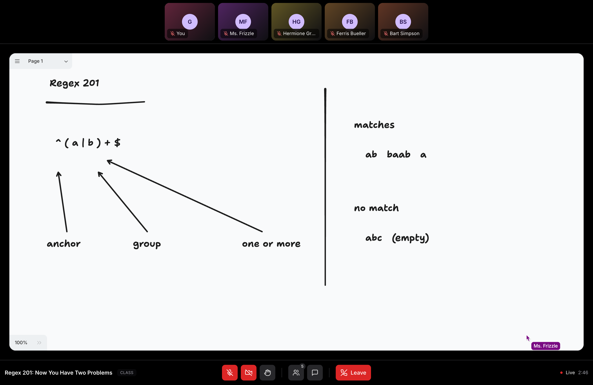
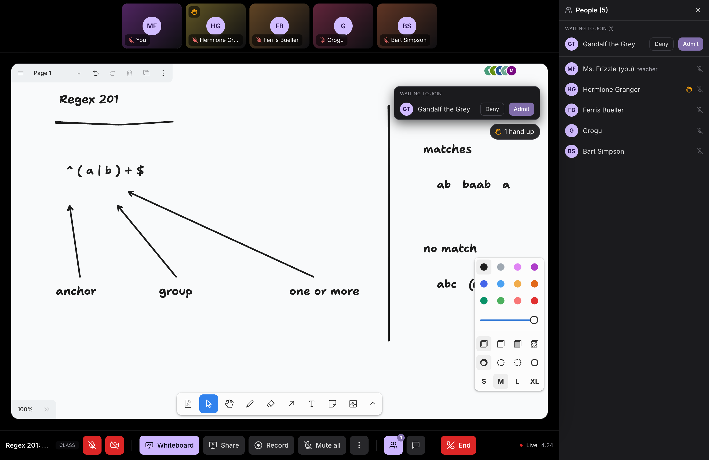
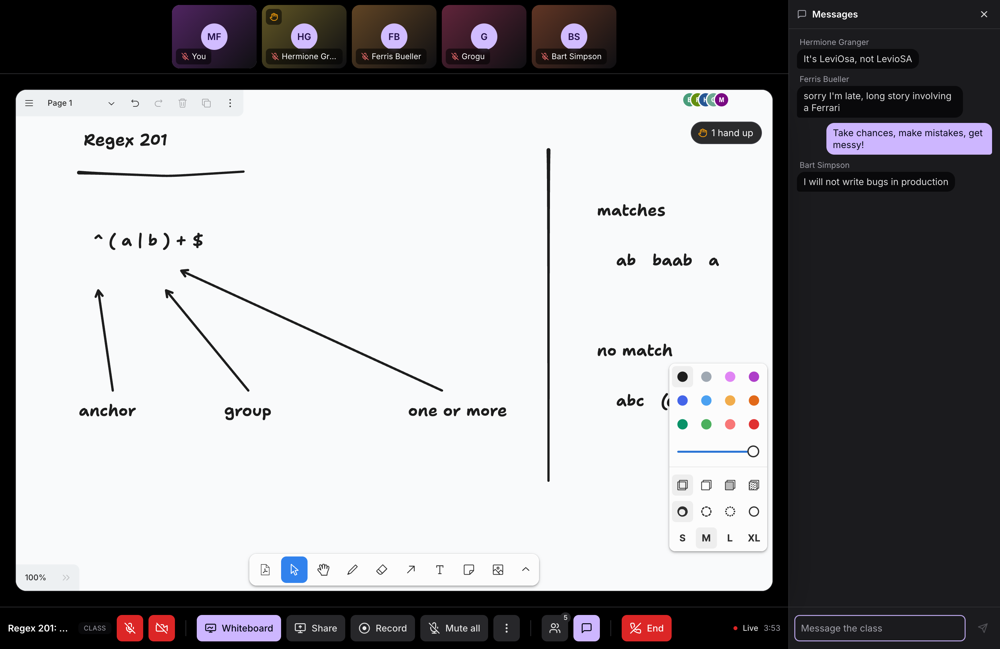
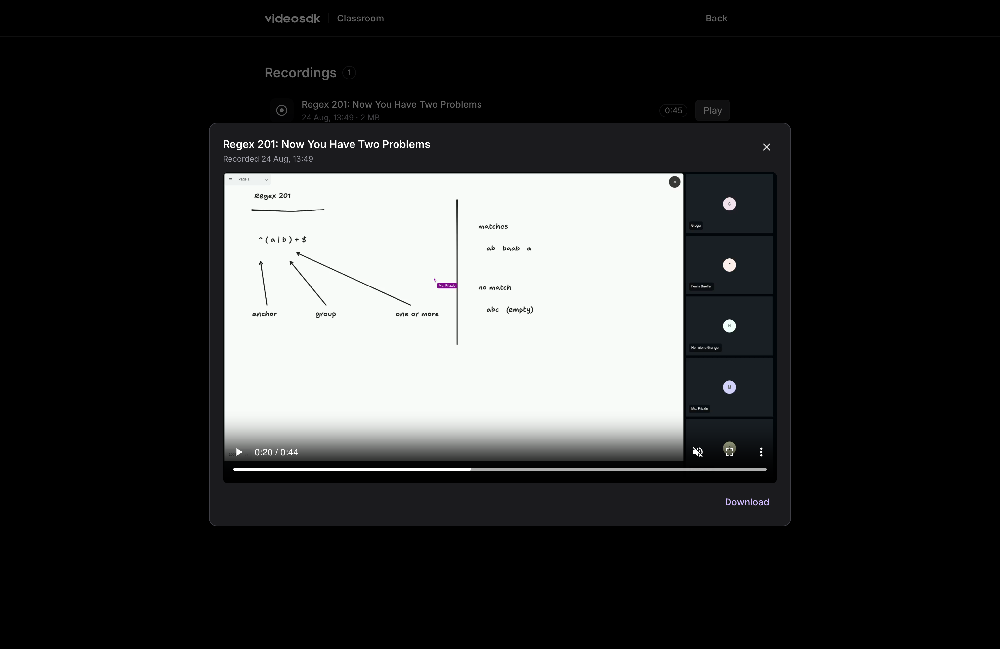
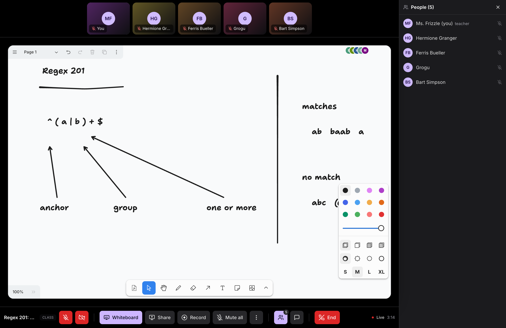
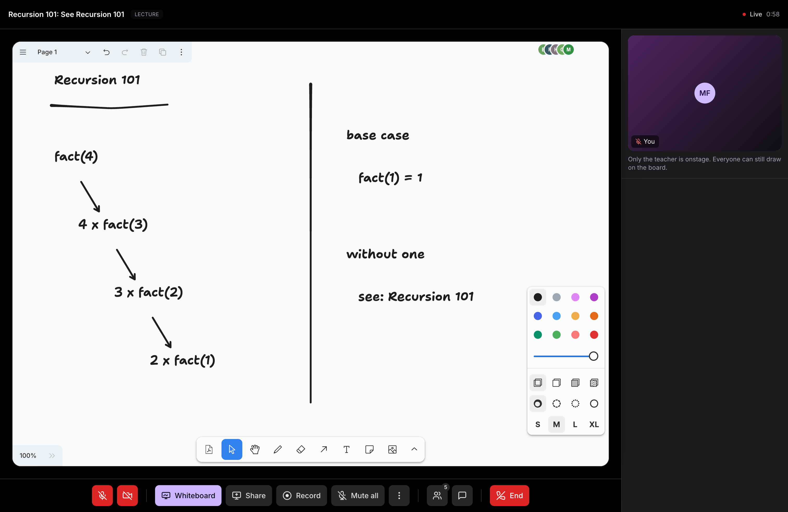

<div align="center">

# Classroom

**An open-source online classroom app built with React and VideoSDK, where a shared whiteboard is the centre of the screen instead of a side panel.**



[](https://videosdk.live) [](https://react.dev) [](https://www.typescriptlang.org) [](https://vite.dev) [](LICENSE) [](https://classroom-by-videosdk.vercel.app)

**[Live demo](https://classroom-by-videosdk.vercel.app) · [Quick start](#quick-start) · [How it works](#how-it-works) · [Whiteboard docs](https://docs.videosdk.live/react/guide/video-and-audio-calling-api-sdk/collaboration-in-meeting/whiteboard)**

</div>

---

A teacher opens a room, students knock to get in, and a shared whiteboard sits at the centre of the screen with live video, chat and hand-raising around it. Video, audio, chat, whiteboard, cloud recording and the lobby all come from VideoSDK. No second real-time vendor appears anywhere in the app.

**[Try the live demo](https://classroom-by-videosdk.vercel.app)** or read on to run it yourself.

## Why Classroom?

- ✅ **The whiteboard is the stage, not a panel.** One hook and one iframe give every participant the same synced canvas. No canvas library to wire up, no second socket connection to manage.
- ✅ **Roles come from the server.** `api/session.ts` compares the caller to the room owner and mints the meeting permissions from that alone. Nothing role-shaped is ever read from the request body, a query string or the URL.
- ✅ **A real lobby, not an open door.** Students knock, the teacher admits or denies from a live queue, and the weaker student token is what makes the knock happen.
- ✅ **Cloud recordings include the board.** The composite captures the whiteboard, the ink that was already on it, and live cursors with participant name tags. A video-only recording of a class misses the actual teaching.
- ✅ **Two class shapes.** Class puts everyone onstage, capped at 12 tiles. Lecture puts the teacher onstage with promote-to-stage for students who need to speak.
- ✅ **Responsive down to a phone**, whiteboard included. The board fills its container at every width rather than locking to 16:9.

## Quick Start

```bash
git clone https://github.com/videosdk-community/classroom
cd classroom && pnpm install
cp .env.example .env          # five values, see Installation
pnpm vercel login && pnpm vercel link
pnpm dev:api                  # http://localhost:3000
```

Use `pnpm dev:api`. It runs `vercel dev`, which serves the app and the `api/` functions from one origin. `pnpm dev` is Vite alone with no `/api` at all, for UI work only.

### The whiteboard, in five lines

```jsx
import { useWhiteboard } from "@videosdk.live/react-sdk";

const { startWhiteboard, stopWhiteboard, whiteboardUrl } = useWhiteboard();

{whiteboardUrl && <iframe src={whiteboardUrl} title="Whiteboard" />}
```

`useWhiteboard` is exactly three members. Call `startWhiteboard()` and `whiteboardUrl` flips from `null` to a URL for every participant at once. That is the whole sync mechanism. Render it in an iframe and a video call becomes a teaching surface.

## Screenshots

**Home.** One command line: type a title, pick a mode, start. Below it your classes and your recordings. An ended class keeps its link and offers Start again.



**Precall.** Camera and mic get checked before anyone walks into the room, with a live level meter to prove the right microphone is the one that is listening.



**The student's board.** Read-only: no toolbar, no undo. The zoom menu still works, so a student can catch up to wherever the teacher drew. The teacher's cursor is labelled as it moves.



**The lobby.** A student holding the weaker token cannot walk in. They knock, and the teacher admits or denies from the queue.



**Chat and raised hands.** Both ride persisted pubsub, so a student who joins late or reloads picks up the room as it stands.



**The recording includes the board.** Ink, live cursors with name tags, and participant tiles, all composited. Owner-only list with a player and a download link.



### Class and Lecture

Mode is picked when the room is created and fixed for its lifetime. The layout follows from it.

**Class.** Everyone is onstage, capped at 12 tiles with a `+N` chip for the rest. Made for a seminar where students are expected to talk.



**Lecture.** Only the teacher is onstage, and a student who needs to speak gets promoted. Everyone can still draw. Made for a room too big for a grid.



## Installation

### Prerequisites

- Node 20 or newer (developed on Node 24)
- pnpm 9 or newer
- A [VideoSDK account](https://app.videosdk.live) for the API key and secret. New accounts start with $20 in free credit
- A [Supabase](https://supabase.com) project for auth and the room table

### Environment

Copy `.env.example` to `.env` and fill in five values.

```bash
# Server-only. Never prefix these with VITE_.
VIDEOSDK_API_KEY=
VIDEOSDK_SECRET=
SUPABASE_SERVICE_ROLE_KEY=

# Safe in the browser. These are meant to ship.
VITE_SUPABASE_URL=
VITE_SUPABASE_PUBLISHABLE_KEY=
```

`VITE_`-prefixed values are inlined into the bundle at build time. `pnpm build` runs `scripts/check-bundle-secrets.mjs`, which walks `dist/` including sourcemaps and fails the build if a server-only name or value reaches it.

One thing worth knowing: `VITE_SUPABASE_URL` is read by `api/_lib/env.ts` as well as by the browser. It is the one `VITE_` name that is also server-side, and that is deliberate. A project URL is not a secret.

### Supabase

Run both files in `supabase/migrations/` oldest first. They create the `public.rooms` table with owner-scoped row-level security and, deliberately, **no insert policy** - rows are written only by `api/rooms.ts` under the service role, so a student never reads or writes the table. The second migration schedules a nightly `pg_cron` job that deletes guest accounts older than 30 days.

Then, in the Supabase dashboard:

1. **Authentication → Providers → Anonymous sign-ins**: on. This is the default way in.
2. **Authentication → Rate Limits**: raise the anonymous limit. The default 30 per hour per IP is one classroom on one network.
3. **Authentication → URL Configuration**: add `http://localhost:3000/**` and your deployed domain to the redirect allowlist.

The built-in email sender is capped at a few messages an hour. `node scripts/dev-session.mjs <email>` signs a test account in without one.

### Deploy

[](https://vercel.com/new/clone?repository-url=https://github.com/videosdk-community/classroom)

Import the repo on Vercel, set the same five variables, ship. `vercel.json` already routes `api/` to functions and everything else to the SPA. Add the deployed origin to the Supabase redirect allowlist afterwards.

## Usage

### As a teacher

Start a class from the home screen and pick **Class** or **Lecture**. Mode is fixed at room creation; there is no mid-class switch. Copy the link and send it out. From there you can admit students from the knock queue, draw on the board, share your screen, mute anyone, ask someone to unmute, promote a student to the Lecture stage, remove a student, disable chat or hand-raising room-wide, and start a cloud recording. **End** closes the room for everyone.

### As a student

Open the link, sign in as a guest with just a name, check your camera and mic in precall, and knock. Once you are in you get the board read-only with zoom still working, video, audio, chat, and a raise-hand that survives a reload.

### The session endpoint

The pattern worth copying into your own app is how a client gets into a room. It asks the server, and the server decides.

```ts
// POST /api/session  { roomId }
{
  meetingId: "abc-defg-hij",
  token: "<HS256 JWT>",        // permissions live inside here
  mode: "class",               // or "lecture"
  title: "Trigonometry, week 3",
  role: "teacher",             // decoration: which buttons to draw
  participantId: "<uuid>",
  teacherParticipantId: "<uuid>",
  expiresIn: 600
}
```

The teacher's token carries `['allow_join', 'allow_mod']`; everyone else gets `['ask_join']`, which is what produces the lobby. `role` decides which controls render. It is never what decides whether a moderation action is allowed.

## How it works

**Roles come from the server.** `api/session.ts` verifies the Supabase session, compares the caller to `public.rooms.owner_id`, and mints the permissions from that alone. Enforcement is the `permissions` array inside the signed token and nowhere else.

**One directory imports the SDK.** `useMeeting`, `useParticipant`, `useWhiteboard` and `usePubSub` each open a subscription per call site, so calling them from feature code multiplies subscriptions. `src/sdk/` subscribes each once in a bridge that renders nothing and pushes into a store; feature hooks read that store through `useSyncExternalStore`. An oxlint rule keeps every other directory out.

**Class controls ride persisted pubsub.** Toggles and raised hands publish on persisted topics, so `onOldMessagesReceived` replays them to late joiners. Each message is a full snapshot rather than a delta, and only the server-derived teacher id counts as a sender. Each client honors the toggles; nothing server-side stops a crafted publish, and `allow_mod` is the only real enforcement in the room.

This split is the pattern most real-time apps land on: cheap, low-latency broadcast state for anything cosmetic, and a small number of server-verified checks for anything that has to hold.

## Project layout

| Path | What is in it |
|---|---|
| `api/` | Vercel functions. `session.ts` mints the meeting token, `rooms.ts` creates a class, `recordings.ts` lists your own |
| `src/sdk/` | The seam. Bridges, store, topics, media. The only SDK importer |
| `src/domain/` | The classroom's own types: Person, ChatMessage, ClassMode |
| `src/session/` | Fetches the room session above precall and room, because `MeetingProvider` reads its config once |
| `src/screens/` | Home, sign-in, precall, classroom, classes, recordings |
| `src/components/` | Board stage, video rail, knock queue, chat, controls |
| `src/design/` | VideoSDK design tokens and UI primitives |
| `src/lib/` | Supabase and API clients, board geometry, the read-only board URL |
| `supabase/migrations/` | The `rooms` table, its RLS policies, and the guest cleanup job |
| `docs/DECISIONS.md` | Every settled decision, with what was probed and what it cost |

## Scripts

| Command | What it does |
|---|---|
| `pnpm dev:api` | App and `api/` functions on port 3000, via `vercel dev`. Use this |
| `pnpm dev` | Vite alone. No `/api`, UI work only |
| `pnpm build` | `tsc -b`, Vite build, then the bundle secret check |
| `pnpm lint` | oxlint, including the SDK seam rule |
| `node scripts/dev-session.mjs <email>` | Sign a test account in without email |
| `node scripts/link.mjs <email>` | A redeemed session as JSON, for seeding a test browser |

## Documentation

- [Whiteboard guide](https://docs.videosdk.live/react/guide/video-and-audio-calling-api-sdk/collaboration-in-meeting/whiteboard)
- [`useWhiteboard` reference](https://docs.videosdk.live/react/api/sdk-reference/use-whiteboard)
- [Authentication and tokens](https://docs.videosdk.live/react/guide/video-and-audio-calling-api-sdk/authentication-and-token)
- [Get an API key](https://app.videosdk.live) - $20 in free credit to start

## Contributing

Contributions are welcome. A few things that will save you a review round:

- Open an issue before anything that changes behaviour, so the decision gets made once
- SDK imports stay inside `src/sdk/`. `pnpm lint` enforces it
- A commit that changes behaviour updates `docs/DECISIONS.md` in the same commit
- There are no tests, by decision. Verification is two real browsers driven by hand, which is how every finding in `docs/DECISIONS.md` was made. Say what you drove and what you saw

## License

MIT - see [LICENSE](LICENSE).
